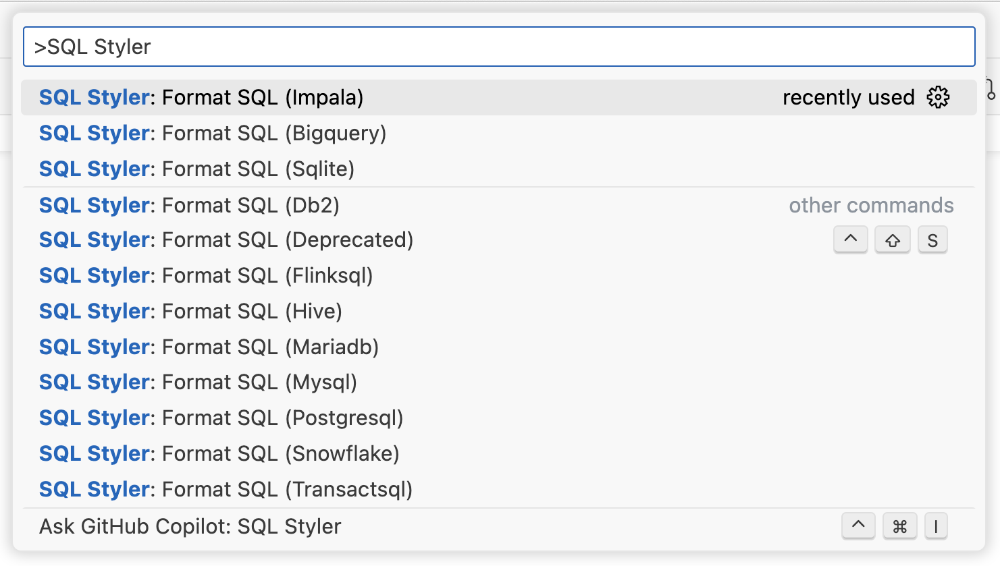

# SQL Styler

Make your SQL look clean.

## Introduction

`SQL Styler` makes your SQL code more organized and readable.

This extension converts plain-text SQL to AST and then converts it back to SQL. It is powered by [`node-sql-parser`](https://github.com/taozhi8833998/node-sql-parser) and supports the following dialects.

* BigQuery
* DB2
* FlinkSQL
* Hive
* Impala
* MariaDB
* MySQL
* PostgreSQL
* Snowflake
* SQLite
* TransactSQL



## Usage

1. Select the SQL text you want to format.
2. Execute `SQL Styler: Format SQL` from the command palette.

## SQL style example

The following are examples of SQL formatted by `SQL Styler`.

```sql
SELECT a.a
     , MAX(a.b) AS max_b
     , MAX(a.c) AS max_c
     , SUM(b.cnt) AS sum_cnt
     , nvl(CAST(MAX(CASE 
                         WHEN a.cnt > 0
                          AND b.max_v > 0 THEN 'A' 
                         WHEN a.cnt > 0
                          AND b.max_v < 0 THEN 'B' 
                         WHEN a.cnt < 0
                          AND b.max_v > 0 THEN 'C' 
                         WHEN a.cnt < 0
                          AND b.max_v < 0 THEN 'D' 
                         ELSE 'Z' 
                    END) AS STRING), '') AS some_case 
  FROM (SELECT a.k
             , b.v
             , c.max_v
             , c.avg_v
             , c.min_v
             , c.cnt 
          FROM tab_a AS a
               INNER JOIN
               tab_b AS b 
                 ON (a.k = b.k
                AND b.d = 'dd')
               LEFT OUTER JOIN
               (SELECT a.k
                     , MAX(b.v) AS max_v
                     , AVG(c.v) AS avg_v
                     , MIN(d.v) AS min_v
                     , COUNT(e.v) AS cnt 
                  FROM tab_e AS a
                       INNER JOIN
                       tab_f AS b 
                         ON a.k = b.k
                       LEFT OUTER JOIN
                       tab_g AS c 
                         ON a.k = c.k
                       LEFT OUTER JOIN
                       tab_h AS d 
                         ON a.k = d.k
                       LEFT OUTER JOIN
                       tab_i AS e 
                         ON a.k = e.k 
                 GROUP BY a) AS c 
                 ON (a.c = c.a) 
         WHERE a.col_1 >= 'filter'
           AND b.col_2 BETWEEN 'fil' AND 'ter') AS a
       LEFT OUTER JOIN
       (SELECT a.k
             , MAX(v) AS max_v 
          FROM tab_c AS a 
         WHERE a.d >= 'filter' 
         GROUP BY a.k 
        HAVING COUNT(1) > 0 
         ORDER BY 2 DESC 
         LIMIT 1) AS b 
         ON (a.k = b.k) 
 ORDER BY 1 ASC, 2 ASC;

CREATE TABLE 
       TAB_A 
     ( COL_A INT
     , COL_B VARCHAR(128)
     , COL_C TEXT
     , COL_D STRING
     );

  WITH CTE_A
    AS (SELECT 1 AS N 
          FROM TAB_A 
         WHERE 1 = 1)
     , CTE_B
    AS (SELECT 1 AS N 
          FROM TAB_A 
         WHERE 1 = 1)
SELECT * 
  FROM CTE_A AS A
       LEFT OUTER JOIN
       CTE_B AS B 
         ON (A.N = B.N);

INSERT OVERWRITE 
       TAB_B 
     ( COL_A
     , COL_B
     , COL_C
     , COL_D
     ) 
SELECT 1
     , 2
     , 3
     , 4 
  FROM (SELECT 2
             , 3 
          FROM TAB_A 
         ORDER BY 1 ASC, 2 ASC 
         LIMIT 1) AS A 
 ORDER BY 1 ASC 
 LIMIT 99, 0;

INSERT INTO 
       TAB_A 
     ( COL_A
     , COL_B
     , COL_C
     , COL_D
     ) VALUES 
     ( 1,2,'A',0.9 ),
     ( 1,2,'A',0.9 ),
     ( 1,2,'A',0.9 ),
     ( 1,2,'A',0.9 ),
     ( 1,2,'A',0.9 ),
     ( 1,2,'A',0.9 ),
     ( 1,2,'A',0.9 );

SELECT 1 AS N 
 UNION ALL 
SELECT 1 
  FROM (SELECT 1 
         UNION ALL 
        SELECT 1 
         UNION ALL 
        SELECT 1) AS A 
 UNION ALL 
SELECT 1;
```